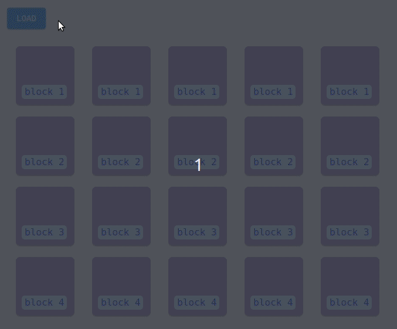

<p align="center">
  
  <br>
  <a href="https://travis-ci.org/lucagez/tattica"></a>
  <a href="https://www.npmjs.org/package/tattica"></a>
  
  
  <a href="https://unpkg.com/tattica"></a>
  <!-- <a href="https://www.npmjs.com/package/tattica"></a> -->
</p>

# Tattica
> A tactical approach to image loading

## Installation

If you are using a bundler:

```sh
npm install --save tattica
```

If you are not:

<a href="https://unpkg.com/tattica@0.1.0/dist/tattica.umd.js">https://unpkg.com/tattica@0.1.0/dist/tattica.umd.js</a>

## Demo

- Codepen: https://codepen.io/lucagez/full/BMmKeK

## How it works

Using Tattica.js you can choose exacly when your images will be loaded in a very straightforward manner.

So you will be able to decide which images needs to served immediately and defer the loading of all the others when your browser is not too busy doing other important things.

- Starts only after `load` event.
- Priority (index) to control the exact loading order of your images.
- `window.requestIdleCallback` used to know when it's the right time for your browser to trigger new requests.
- `intersectionObservers` used to load anyway images that are in the viewport.
- A handy `callback` on every image load (now used to trigger the pulse animation).
- Possibility to define blocks of loading images (decide which requests need to be sync and which async).
- `navigator.connection.effectiveType` to check the type of connection of your users and load images accordingly.
- `setTimeout` will take care that no image will stop forever your loading queue.
- Possibility to define a fallback for images that returns errors.
- Super simple to integrate in your workflow (you'll only need to write html attributes).
- Friendly error messages (:

## API

`tattica` accepts an optional config object with the following parameters:

- `flag`: Attribute to search in the DOM to select elements for the loading queue. Defaults at `data-flag`.
- `string`: String to use to set non-empty src attribute to every image (in case a src is empty).
- `loadIntersections`: Defaults to TRUE. Detect elements that enter the
viewport and load image if not already loaded.
- `timeout`: Sets maximum loading time (in ms) for an image to load sync. Defaults to 1000ms.
It can be set to FALSE. However setting it to false is discouraged in a real-world scenario.
- `callback`: Pass callback to be executed after an image loading resolve. Defaults to null.
- `timestamp`: If set to TRUE prints Date.now() in `timestamp` image attribute.
Useful for testing purpose. eg: check if images are loading synchronously

## Attributes

`tattica` works with attributes set in html.
Here is a list with all the available attributes.

- `data-flag`: required to know which images need to be pushed into the loading queue.
- `data-block`: required to know which images, belonging to the same block, need to be loaded async. Images of the same block must have `data-block` attribute equal to the same number.
- `data-priority`: equals to increasing numbers. Elements with `data-priority` get loaded first.
- `data-priority-block`: works as `data-block` but in the priority queue.
- `data-src-medium`: URL of images to be used in case of medium speed network (3G).
- `data-src-slow`: URL of images to be used in case of slow network (2G).

## Rules

- Tattica will make a loading queue only of images with `data-flag` attribute.
- You should NOT use tatica for images contained in the viewport that first gets served to the user.
- You should always set a placeholder in `src`. If anything is provided, a default on will be loaded to avoid a broken image.
- Tattica will make two separate queues: [1] priority,  [2] normal
- Every image in the priority queue gets loaded first. No matter the position in the DOM.
- You can add an image to priority queue by setting a `data-priority` or `data-priority-block` attribute on it.
- `data-priority` attributes should be increasing numbers to make tattica know how to sort the queue.
- images belonging to the same block should have attribte `data-block` or `data-priority-block` equal to the same number.
- refer to `/demo/show/index.html` for every example. 


## Recipes

#### Initialize tattica

```javascript
  const tattica = require('tattica');

  const config = {
  // A timestamp is printed on elements for testing purposes
  timestamp: true,

  // Tells tattica not to load images in the viewport
  loadIntersections: false,

  // Trigger your callback fired after every image load
  callback: yourCallback,

  // Deactivated timeout to show that tattica can behave truly sync.
  // In a real-world scenario it should always be a value. Defaults: 1000ms
  timeout: false,
};

  tattica(config);

```

#### Load images sync

Every image is loaded synchronously.

```html
  <div class="container">
    
    
    
    <!-- ... -->
  </div>
```

#### Block loading

Images loaded in subsequent blocks.
The last image will not start loading until every image of the block is loaded.

```html
  
  
  
  
```

#### Priority loading

Images with `data-priority` attribute are loaded first in a separate queue. No matter the position in the DOM.

```html
   
   <!-- second -->
  
   <!-- first -->
```

#### Adaptive serving

You can define `data-src-slow` and/or `data-src-medium`.
URL provided to those attributes will be used in case of a slow network instead of the URL in `data-src`.

```html
   
```

## License

Licensed under the MIT license.

